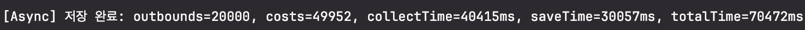

## 테스트

### 테스트 환경
응답은 100ms, 멀티스레드는 10개, 데이터는 20000개로 고정, 저장 1000개 단위

단일 스레드 호출 결과

멀티 스레드 호출 결과

비동기 호출 결과

### 테스트 환경
응답 1000ms 스레드 10개, 병렬 처리 10개, 데이터 20000개, 저장 1000개 단위

멀티스레드 호출 결과

비동기 호출 결과
